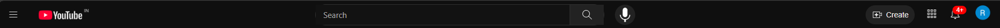
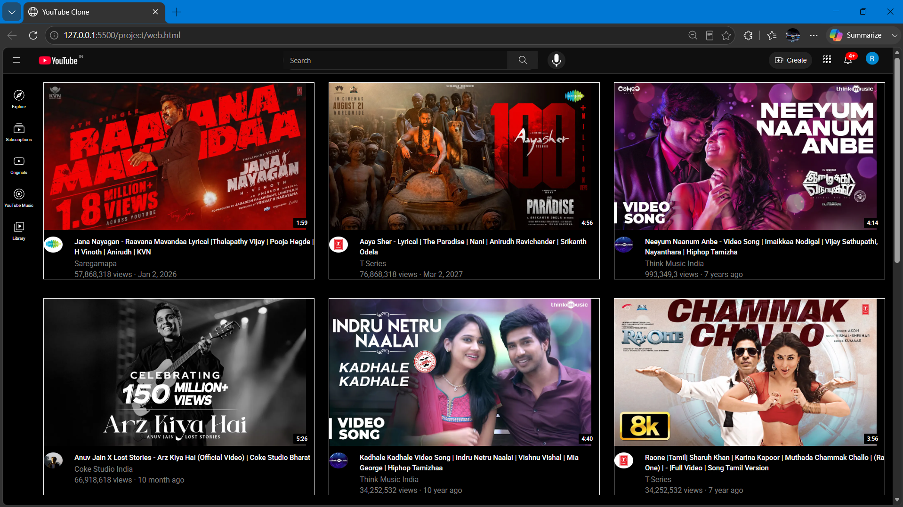

# 🎬 YouTube Clone

A pixel-close recreation of the YouTube homepage, built entirely with **HTML and CSS** — no JavaScript, no frameworks, no UI libraries. Every layout, hover state, tooltip, and responsive breakpoint here is hand-written CSS.

This project was built as a front-end fundamentals exercise: the goal wasn't just to "make something that looks like YouTube," but to recreate the small interaction details that are easy to overlook — header tooltips, notification badges, video duration overlays, and a sidebar that holds its position independently of page scroll.

---

## 📸 Preview

---

## ✨ Highlights

- **Fixed header** with a working search bar, voice-search button, Create button, apps grid icon, notification badge, and profile avatar
- **Icon-rail sidebar** (Explore, Subscriptions, Originals, YouTube Music, Library) that stays pinned beneath the header
- **Responsive video grid** that reflows from a wide multi-column layout down to two columns on smaller screens, handled entirely with CSS media queries — no JS resize listeners
- **CSS-only tooltips** on every header icon, appearing on hover with a smooth fade
- **Video duration and notification-count badges**, positioned with absolute layering rather than baked into images
- **Dark theme** matched closely to YouTube's actual color palette and spacing rhythm

## 🧱 Tech Stack

| Layer | Technology |
|---|---|
| Structure | HTML5 (semantic tags: `header`, `nav`, `main`, `section`) |
| Styling | CSS3 — Flexbox, Grid, media queries, pseudo-classes |
| Interactivity | None — all hover/tooltip behavior is pure CSS |
| Build tools | None — static files only |

## 📁 Project Structure

The project separates concerns across dedicated stylesheets rather than one large CSS file:

- A shared base stylesheet for global typography and page-level layout
- A dedicated stylesheet for the header
- A dedicated stylesheet for the sidebar
- A dedicated stylesheet for the video grid
- A folder of icon and logo assets used throughout the header and sidebar
- A folder of video thumbnails and channel avatars used in the video grid

This separation makes each section of the UI independently maintainable — the header can be restyled without touching grid or sidebar rules, and vice versa.

## 🚀 Running the Project

Open the main HTML file directly in a browser, or — for the most accurate behavior with relative asset paths — serve the project folder through a lightweight local server (such as the VS Code "Live Server" extension) rather than opening the file directly from disk.

## 🎯 What This Project Reinforced

- How real-world UIs lean heavily on `position: relative` / `position: absolute` pairings for badges, tooltips, and overlays
- How to structure a responsive grid with breakpoints that feel natural rather than abrupt
- The amount of fine-tuning (spacing, hover backgrounds, icon sizing) required to make a clone feel "right" rather than just "close"

## ⚠️ Disclaimer

This is a personal, non-commercial project built solely for front-end practice. It is **not affiliated with, endorsed by, or connected to YouTube or Google in any way**. All video titles, channel names, and thumbnails used are placeholder content for layout demonstration purposes only.

## 👤 Author

**Rohith E**
GitHub: [ROHITHELAYARAJA](https://github.com/ROHITHELAYARAJA)
LinkedIn: [rohith-e-sde](https://linkedin.com/in/rohith-e-sde/)
